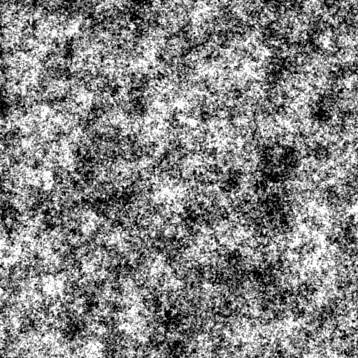

PerlinNoise
===================

## Perlin Noise

Perlin Noise for CPU and CUDA

## VS Solution
* PerlinNoise - CPU computed Perlin Noise
* PerlinNoiseCuda - CUDA computed Perlin Noise

## Command Line

``
PerlinNoise.exe <width> <height> <persistence> <octaves> <zoom> <seed> <outputImg>
``
* Width - width of the image in pixels
* Height - height of the image in pixels
* Persistence - calculation persistence (multiplier of amplitude in each iteration)
* Octaves - total number of octaves (iterations)
* Zoom - initial frequency (higher value means higher frequency and more detailed image)
* Seed - initial seed for random number generator
* OutputImg - path to output image (BMP format)